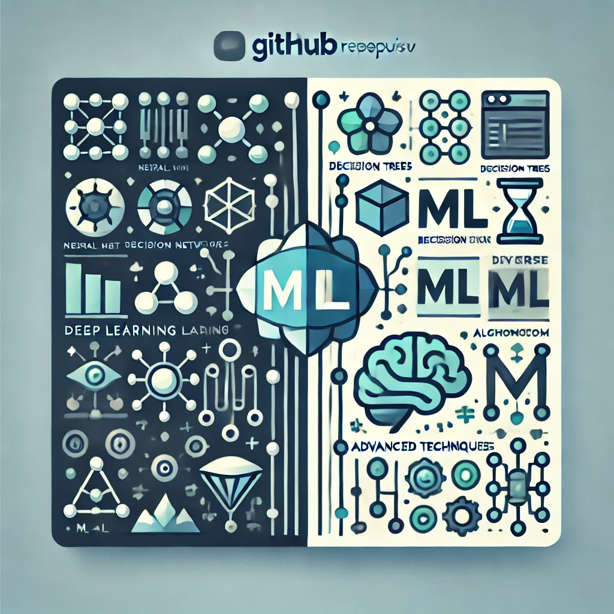

# ML_ALL

In this codebase I will keep all of my ML learning. The repository is divided into two main pieces. First section will keep the content of courses while the second section will hold the code from miscellinous sources. 

